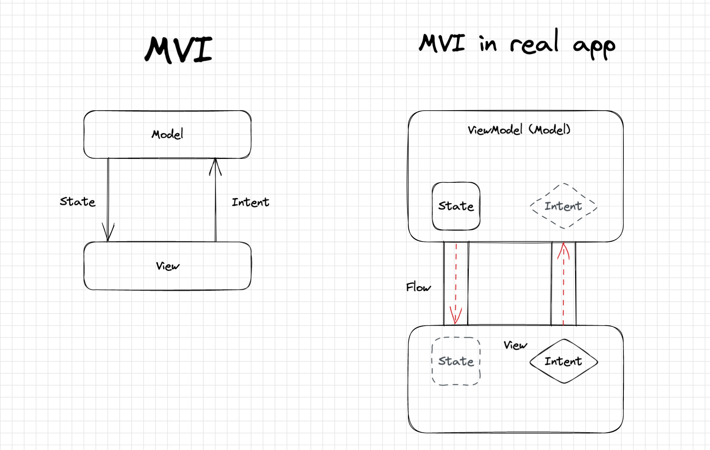

# 项目说明

学习使用 MVI 架构（即 Model-View-Intent）开发 compose desktop 应用(同样适用于kotlin multiplatform)。

## 前提条件(务必按顺序阅读)

- [了解Google Android 应用开发的架构指南](https://developer.android.com/topic/architecture)
- [了解Jetpack Compose 界面开发架构](https://developer.android.com/jetpack/compose/architecture)
- [理解 Compose 编程思想](https://developer.android.com/jetpack/compose/mental-model)
- [状态管理](https://developer.android.com/jetpack/compose/state)
- [生命周期](https://developer.android.com/jetpack/compose/lifecycle)

## MVI 框架

* mvi 框架

* android mvi 框架

* 单向数据流在 mvi 框架中的应用

* UDF 在应用架构中的运作方式图示。

> 状态向下流动、事件向上流动的这种模式称为单向数据流 (UDF)。这种模式对应用架构的影响如下：
> - ViewModel 会存储并公开界面要使用的状态。界面状态是经过 ViewModel 转换的应用数据。
> - 界面会向 ViewModel 发送用户事件通知。
> - ViewModel 会处理用户操作并更新状态。
> - 更新后的状态将反馈给界面以进行呈现。
> - 系统会对导致状态更改的所有事件重复上述操作。

* 状态管理

* 逻辑层级

## 实践

- `DemoViewModel.kt` - 它是根据官方文档中 [在 Compose 中管理状态](https://developer.android.com/jetpack/compose/state#managing-state) 的介绍，实现的一个普通"状态容器"类。并非真正意义上的 "ViewModel"。
- `GenericViewModel.kt` - 它是根据(How to write your own MVI library and why you shouldn't
  )[https://www.youtube.com/watch?v=E6obYmkkdko]的介绍，实现的一个简单通用 MVI 框架。它的实现仅仅用了不到 30 行的代码。推荐官方实现的 MVI 框架 [orbit-mvi](https://github.com/orbit-mvi/orbit-mvi) 。

## 总结

- 声明式 UI 描述界面
- 界面是界面状态的直观呈现。对界面状态所做的任何更改都会立即反映在界面中。
- 状态向下，事件向上
- 单向数据流 (UDF)，作为提供和管理界面状态的方式
- 根据 UDF 原则使用可观察数据类型公开界面状态